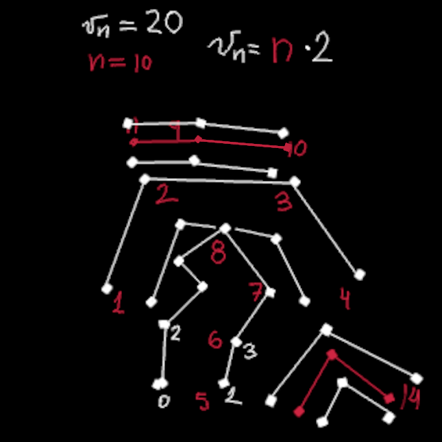

# Paths to vertex shader
 Calculation of number of Vertexes and triangles per path
    On red the roads, represented by paths and edges,
    on white, the vertexes generated for representation  in openGL
    
