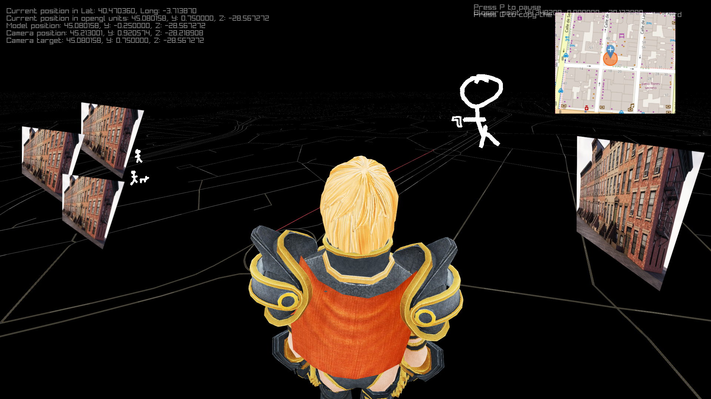

# VRoads

Just some testing with _Raylib_ and _OSM_
And maybe and MVP for a game/simulator



## Building the project:

 The _classic_ cmake stuff: (this is not needed using build.sh (see next section)
```c
    git clone <thisRepo>;
    git submodules update --init
    mkdir build; cd build;
    cmake ..
```

## Running the project:

Running this project, for now is kinda cringe, or not.

Use `build.sh`:
- `build.sh -er`, for executing the project after compiling the release mode( -O3)
- `build.sh -ed`, for executing the project after compiling the debug mode (more logs and stuff)
- `build.sh -gd`, for executing the project with GDB after compiling it in debug mode;

If the project runs successfully, a data.json will be created, it contains the data from the OSM queries.
Redownloading can be avoid by using environment variables. 

I usually run these parameters, __DISTANCE_FROM_CENTER (meters) is ignored if OFFLINE is set__

```shell
OFFLINE="data.json"  SCALE=".001" ROADWIDTH=".005" DISTANCE_FROM_CENTER="5000.0" ./build.sh -er
```


## Structure of the project:
```
    |_ src/   - The sourceCode
    |_ resources/ -  Textures and stuff (directory structure is ignored when compiling, there's just too few stuff for this to matter)
    |_ ./build.sh  -  Script for building, debugging, etc
    |_ external/ - git submodules
    |_ Docs/ - Idk, 
```

# Some roadmaps/stuff

1. Loading model ☑️
2. Replacing built in camera ☑️
3. Make a road model ☑️
4. Download road data ☑️
5. Make a road from data ☑️
6. USe level field of struct way in road generation --kinda, need to implement the Dataconsumer section of this: https://wiki.openstreetmap.org/wiki/Key:layer
7. Improve GenRoadFromPath - Sat Mar  2 08:58:19 PM CET 2024 - ☑️
!!!!!! 6. Chunk the roads (add a new road when the camera is close to the end of the road) 
6. __From now on, Autocompleted by Copilot__ ⬇️
8. https://osmbuildings.org/?lat=52.52170&lon=13.42534&zoom=15.6&tilt=31&rotation=-11
6. Make a car model  
7. Make a car move
8. Make a car turn
9. Make a car accelerate
10. Make a car brake


# Very wished  🌟
1. Multiplayer support
7. VR support
8. Scripting support
2. Physics support
3. Sound support
4. Music support
5. AI support
6. Networking support

# Optional good looking
1. Add a skybox
2. Add a sun
3. Add a moon
4. Add a starfield
5. Add a cloud layer
6. Add a rain layer
7. Add a snow layer
8. Add a fog layer
9. Add a dust layer
10. Add a sandstorm layer
11. Add a thunderstorm layer
12. Add a tornado layer
13. Add a hurricane layer
14. Add a volcano layer


